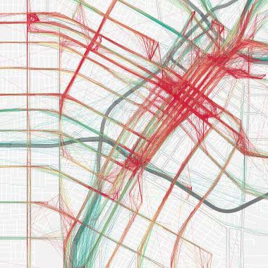

## Side Projects

### **The LA Bus Map**
The map displays all LA Metro transit service for the past 24 hours, colored based on bus speed. The concept originally came from Eric Fisher's transit maps, but the code from this particular project was forked from the Boston Bus Map. For Los Angeles, I used MapBox's TileMill to create custom map tiles for three different zoom levels and created separate layers to differentiate by local / rapid service.

*javascript, PHP, MySQL* ( [website](http://www.labusmap.com) / [code](http://www.github.com/black-tea) / [paper](documents/TRB2015_LABusMap_Paper.pdf) / [slides](documents/TRB2015_LABusMap_Slides.pdf) ) 
